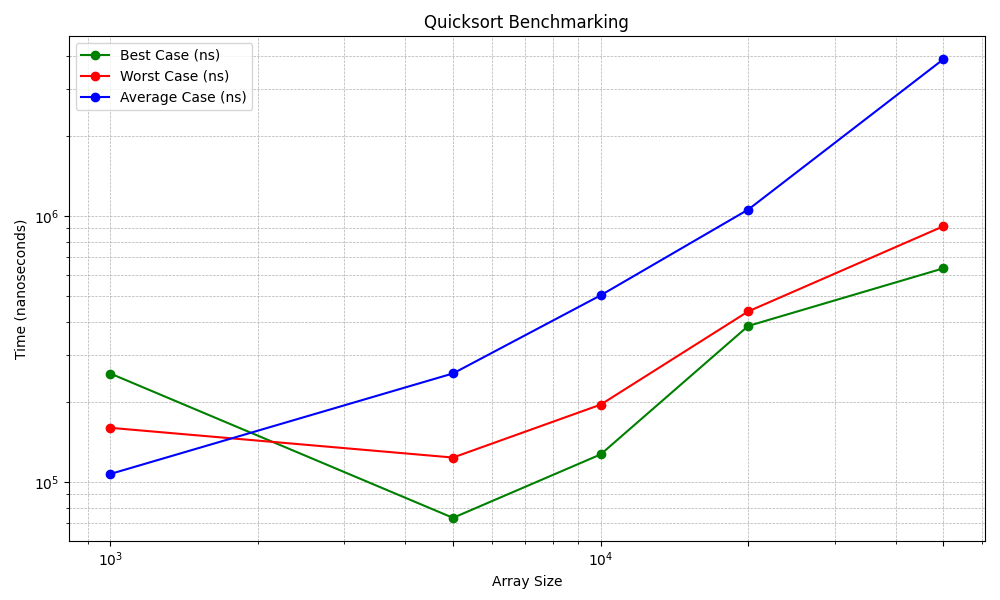

# Hands_On_6

# Problem 1

* Code for QuickSort with Random Pivot  is  [`QuickSortRandom.py`](Quicksort_Random.py)

* Code for QuickSort with NonRandom Pivot  is  [`QuickSortNonRandom.py`](Quicksort_Non-Random.py)

# Problem 2

* Code for Benchmark is given [`NonRandomBenchmark.py`](Quicksort_Non-Random_Benchmark.py)
 
 

# Problem 3

